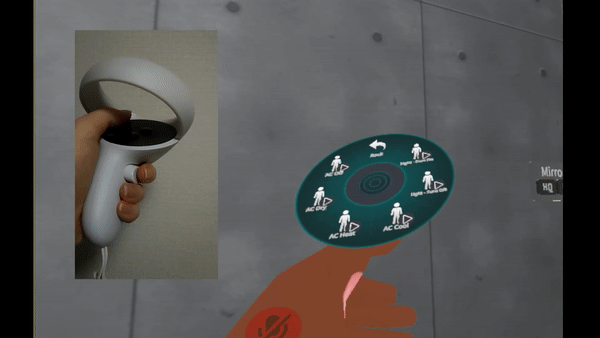
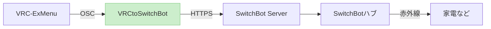
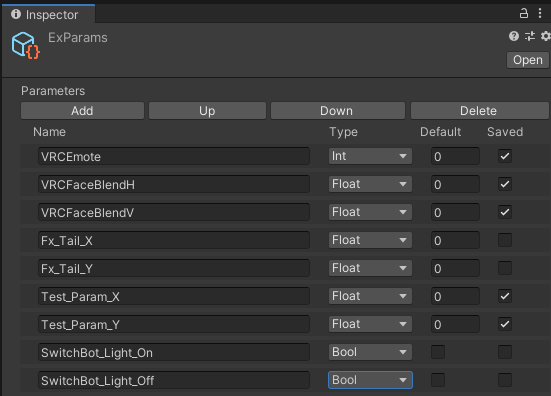
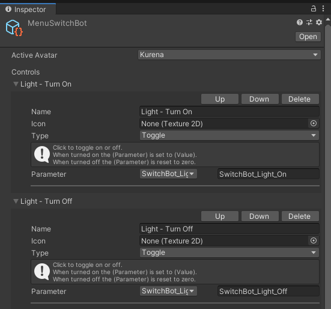
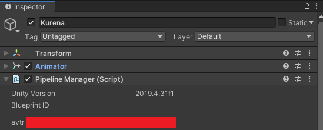

# VRCtoSwitchBot

VRChatとSwitchBotを連携させ、VRCのExpressionMenuからリアルお部屋の家電類を制御できるようにするツールです。  
**ExpressionMenuの操作で、部屋の照明のオン・オフなどができます。**  
リアル空間への用事を減らすために作っています。

ExpressionParameterの変化をOSCで受け取り、事前に設定した家電操作をSwitchBot Public APIに投げます。

つくっているひと
* [@aruma256_vr](https://twitter.com/aruma256_vr) (VRC用アカウント)
* [@aruma256](https://twitter.com/aruma256) (技術と日常)

# 必要なリアルアイテム

* [SwitchBotハブミニ](https://www.switchbot.jp/pages/switchbot-hub-mini)
    * スマート赤外線リモコンです。スマホアプリから家電操作ができて便利
    * Amazonで5000円程で購入できます。
    * ハブミニ互換品でも使えそうですが、未確認です。
* 赤外線リモコンでオンオフ可能な機器
* PCVR環境(Windows 10 のみ動作確認)

# 導入手順

1. SwitchBotハブミニ に操作する家電を登録し、スマホアプリからオン・オフできるようにしておく。
1. (Unity)アバターにExpressionParameterを追加する
    * パラメータ名は任意（下の画像では `SwitchBot_Light` とした）
    
    * Type は `Bool` を選択（将来的にはIntをサポートしたい）
    * Default は 対象家電の初期状態に合わせておくと便利そう
        * 「照明**ON** のままVRChatログインし、メニューを一度クリックすると照明OFF、もう一度クリックするとON」→ チェックを**入れておく**
        * 「扇風機**OFF** のままログインし、メニューを一度クリックするとON」→ チェックを**外しておく**
    * Saved はチェックを入れておく
1. (Unity)アバターにExpressionMenuを追加する
    * Add Control で項目を追加する
    * Nameは任意（下の画像では `SwitchBot Light` とした）
        * ここがVRC内でのメニューに表示される
    * Iconは任意
    * Typeは `Toggle` を選択する（将来的には他のタイプもサポートしたい）
    * **Parameterは上で作成したパラメータを選択する**
    
1. (Unity)**アバターのBlueprintIDを確認し、PC内にOSCファイルが存在する場合は削除しておく**
    * ここの赤塗り部分に記載されているIDを確認し、
    PCの `C:/Users/(ユーザー名)/AppData/LocalLow/VRChat/VRChat/OSC/(userID)/Avatars/` にBlueprintIDと同一名のファイルが存在する場合、それを削除しておく
    
1. (Unity)アバターをBuild/Publishする
1. SwitchBotのトークンを取得する
    * SwitchBotスマホアプリ → プロフィール → 設定 → 「アプリバージョン」を連打 → 開発者向けオプション → トークンを取得
    * このトークンは他者と共有しないでください。トークンを知っている人はあなたの家電を操作できてしまいます。
1. [ここ](https://github.com/aruma256/VRCtoSwitchBot/releases/tag/v0.2.4)から、VRCtoSwitchBotのzipをダウンロード・展開し、exeファイルを実行する
    * Python3.10環境がある方は、ソースをダウンロードしてrequirementsインストールしてmain.pyを実行でもOK

# 使用方法

1. `main.py` をダブルクリックし実行する
1. （初回のみ）「トークン設定」ボタンをクリックし、SwitchBotトークンを入力する
1. （初回のみ）デバイスの「設定する」をクリックし、操作対象の家電、紐づけるExpressionParameter名を入力する
1. （初回のみ）「手動でオン」「手動でオフ」をクリックし、家電を操作できることを確認する
1. VRChatのExpressionMenuから操作する
    * 実際に動作するまで数秒のラグがある場合があります
1. （動作OKなら）「現在の設定を保存する」をクリックすると、次回からは設定済みの状態で起動するようになる

# オン・オフ以外の細かい操作もしたい

将来的に実装できたらいいなぁ...とは思っています。  
現時点では、ハック的な方法ですが  
「SwitchBotに オン操作 として目的の赤外線信号を覚えさせる」  
という方法ができそうです。

# その他

* [RT](https://twitter.com/aruma256_vr/status/1566372473574404097) / [ツイート](https://twitter.com/intent/tweet?text=%23VRCtoSwitchBot)は最大の支援
* （GitHubアカウントをお持ちの方は、最上部のsponsorボタンも使えるようです...使ったことはありませんが...）

